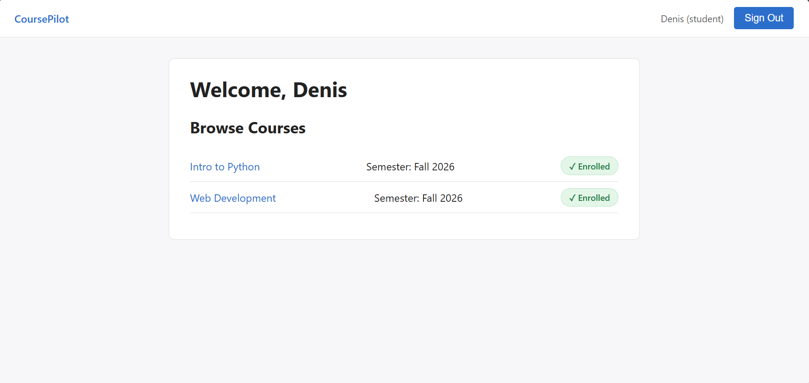

# CoursePilot

CoursePilot is a full-stack web application that helps university students organize their courses and track assignment deadlines in one place. Instructors create courses and post assignments with due dates, students enroll in courses and track their own progress, and admins manage user accounts and oversee the platform. It was built as a Computer Science student juggling multiple courses each semester, to solve a problem I deal with directly: keeping track of what's due, for which course, and when.

## User Stories

1. **User:** As a user, I want to sign up and sign in so that I can securely access CoursePilot.
2. **User:** As a user, I want to sign out so that I can securely end my session.
3. **User:** As a user, I want role-based access so that I can only view and perform actions allowed for my role.
4. **Student:** As a student, I want to view the courses I'm enrolled in so I can see my current workload.
5. **Student:** As a student, I want to enroll in a course so that I can access its assignments.
6. **Student:** As a student, I want to unenroll from a course so that I can remove courses I no longer need.
7. **Student:** As a student, I want to view assignments for my enrolled courses so I know what's due.
8. **Student:** As a student, I want to track the status of each assignment (not started / in progress / done) so I can manage my own progress.
9. **Instructor:** As an instructor, I want to create a course so that I can organize my teaching materials.
10. **Instructor:** As an instructor, I want to edit or delete a course I created so I can keep information accurate.
11. **Instructor:** As an instructor, I want to create assignments within my course so students know what to complete.
12. **Instructor:** As an instructor, I want to edit or delete assignments I created so I can correct mistakes or remove outdated tasks.
13. **Instructor:** As an instructor, I want to view the list of students enrolled in my course so I know who has access.
14. **Admin:** As an admin, I want to view and manage all users so I can control access to the platform.
15. **Admin:** As an admin, I want to change a user's role so that access permissions stay accurate.
16. **Admin:** As an admin, I want to view all courses in the system so I can monitor platform activity.
17. **Admin:** As an admin, I want to delete inappropriate or duplicate courses so I can keep the platform clean.

## Getting Started

- **Deployed App:** [Course and Assignment](https://frontend-react-course-and-assignment.onrender.com)
- **Planning Materials:**
  - [ERD](https://viewer.diagrams.net/?tags=%7B%7D&lightbox=1&highlight=0000ff&edit=_blank&layers=1&nav=1&title=Untitled%20Diagram.drawio&dark=auto#R%3Cmxfile%3E%3Cdiagram%20name%3D%22Page-1%22%20id%3D%22cVilJnYjOyF1tsmqhn-e%22%3E7Z1td6K6Fsc%2FjWvNvOhZPAjoy2q1d%2B7pw5zazr3n1axUUuUOiifitJ1PfxMgigp0qwTF2Z2ujsQQIPll5x922DTM7uTtmpHZ%2BDZwqd8wNPetYV41DMNut%2FlfkfAeJzQtJ04YMc%2BNk%2FRVwsD7RZNELUldeC6dr2UMg8APvdl64jCYTukwXEsjjAWv69leAn%2F9qDMyolsJgyHxt1P%2F47nhOE5tWdoq%2FV%2FUG43lkXUt%2BWZCZOYkYT4mbvCaSjJ7DbPLgiCMP03eutQXdSfrJd6vn%2FPt8sQYnYYZOzzNKbt%2F%2Fp%2BoE0PzyTNvlihTcnaUTYjnXpGQJMlOp2HYDcPkFW%2Fyj1r0a%2F%2BzEKfXcUW%2B5VbDvFz7lrIrj4wYmTSs7lTuKn6fBr0H8cnp8t%2BLiyA6iNa9f3oY9ER6XI7VXRU1ZJSEvL0N7RMRf73pPGSLYRiwz2v5YEfq3T3c39zc9u4es49Gpyzw%2FdXR5uHC5bVZfKjV6e92sDE%2FxD7lXg4GX67vdiw3r3q2jpr%2B9aZhDJihff2zKCNvE2864h8WHLIpmVBQZsqJ80E5Z2Q%2Bfw2YC8rMm7Dw%2BJxdGnr8HLmRiOhyv5NwawfnKqveUm1Scs2FXlh82suc3PwNmTcLvWDr9DLzz%2BmEzkPKAOe77Fzfo1PvF576IfW43jdKqss4Y9JnIVcQ7zAMFmxOd7zi2FLscsnr3fbk8RHXKv5b0O%2FRRzXVWAzOyoQZ3YLBiA%2F1L95ocziaLsTwuNrJiQe75XjZf7q16fNl%2F%2B7fr5PZ5YPpWdd%2FXejLcXg5viZCgjxLBaBtD7TJ2DsP32WmEQsWM37YkJHpPM7aCRZTV6gPXYw0rhd%2B4UUnm34w%2FEHd63inK3G%2BUQFfieuKVuOZ4gsXR%2FlJWUjfUgdOzveaBhMasneehSQiZ7RMWukA%2FiG5NrmZUgaFSiEeNFJq4UtSlfwqLre%2B7JA5HawqhKudmfiYVGRnHhIWJvKuacatGBJvyu1UXCVD3r%2FIbO7F9S4ufzj2fPeGvAeLUBYktzov3ht1H2J1J%2FbmQu%2BGFyY3X3jhycF0O9nuk4nnCxX6yOjzYjim4nJvB5y1b5S5ZMoFTveSeYRD0J3zVrzg1eK9RKfOgh9L9SeKJ743Ek055M0sLqDD6Jwf7YbMwyTHOJz48lw83%2B8GfiAu1BdK8cIl7McnDmqv2%2Bv2%2BxHspv5iaIb2eXm47D3apqNdxd3DHEY%2Fn5Ory84f%2F2zm32q3b8Rf0M1GL%2Bw4xnbHSXeQ%2FM621msQkixIeFtpWoto2hYM0TeWE32TbnSe%2FhL97GI0xqlpi9G24v1eV3Mcw7TjNFlMO5k7JDM5MzGMhxmfrXlNJjrmtg3OxzIfsQcx%2F%2BqMA%2Bb9EmD5CUNp7KLtV2%2Fikymf2BF3I6kTRBPZjCazm47dcrKazNSbptXMZGSbZ5cFs0fCRjRMEmYBH2%2BjKra4hujwSu9qf1gN60r0aqujr7b5r8jOOBZC2BEvqirKeXulgrlOGMjRxqcvsnyWUCA%2BPwdhGEySjVIBM518vuSdAXNnnmDwNIHwmLnw8F1D3ucfhC6YjiJTtS4TtJJ4yKvzg0xT3Oz6qtn1dFPrKQbSZivO2%2BFiZsglyU28Z4unBLzpX%2FzoTsbYc7n2zjClCSOrYSXSjOVw0y6wO0lhq4bauTTih2JKG9JEvm3CtzzP%2FXm0kMfj8%2BiWhaOumWvDZLl4LkuvkE8b%2BTw6n1%2F%2FLIvP5jqeertgmN2dz81BuwI8HdSC9daCkpkCLdjafW4Bg6cFhMdB26bMtslbk%2BWgc8B4CyitAnvWRiSPjuTSj1USlCWKwqLSK6RUz7gNjphWjGlZeJaoCQtKr5LOjNUQKArPTBTqhqo7hLoBxEfP92GgdUNdWK5Ngzo9EEqFUMaLllAW5rEHda4gpKgLj4An1NeCurDGutC2VelCqCtEcobWDXWhcpsGdYAglAqhXC5RR2mYhx%2FU14KcojQ8Ap5QvwtKw%2FpKQ0NrK5KGWY8FFHKG1k3F3ZnpYoLCUCIJdYIgkgqRjB5HRFGYxyjY04KMoiisHk980OQ3EIWWoUoUQr0hkjO0bgqs2%2Bp5YxSGMW1gLwhiqQ7L1LPvKA%2FzAIQ6XJBUlIdl4pkXA0EGgBEHyoiCkPE1xkE4izgI6ZYtNllOCl8MhVAuJwKIZ6JTI8s0a5rdu%2ByXPYEwtYxQCDLcW1KMKX1by6B2FcZCMKB%2BNSN%2FKT5OUo87Sc2IhiARUh0NwQD7vVoosZRJrH3jIWSQc4jqP4l4CCbUlYZEnl5EhAyEdLlCqYRpaUHpVRIKfrwICT25mAgZDG1MTA3NKZPQI%2FgtTKhbDTXhyWrCDMfFhiYsMqQHaUIT6vaSnKF9w3XOym0aOG4bQqkOyjjQcFkOixKVYUHpVUIKDuaGkNbOYXGQLjyJ9Swm2J%2BGurC%2BulA3Vd0sNKHPGknQ0LyhMFRu1KAOEIRS5Sqr1HslUB7mEQh1tiCqKA%2Brl4dNsOcF5WGN5aGjKj5CE%2BoXkaCheUN5qNyoQX0hCKVKKOVb6FAb5uEHdbogp6gNj6ANwc8yoTasrzY05HO25WtDqGdEgobm7ZTWGZ6jMIQ6Q5BIpUSuvXQY1WEOg1DPC8KqENb%2BnksOfwd9iI%2Bh%2FA760DZU6UOoa6SJa6oxVkJlZs2CukQQy3rFSjg7hWiBnS9IKt4%2FLBHPvFgJvbuH%2B5ub297dY3ywjHgJOVkwZsJZxEzYbN1i82WkUMa4CeWyIkwssVualmWmu45paRmTCS362XcyYegZswm5QEDGTdh4nkk3841c2WETLKi7TUaHw%2FlqHearkjDVYRMsqDtMcoZqC90ZavU%2F1MGGRJ5g2ISseHstlTNUWXqVhEIdbkjoCYZNAMTza5VJ6BF8GBbUyYaa8GQ1of6hJmypWv5sQV1gVr4LDO3b0TThNjmHDLkfl1aFQYM61ZBIpQvyFzxnuPf6lm2UytSGBaVXSKoN9bMhqSe4vmWboTK1YX7pVQIKda%2BhNjxZbfjx%2FULdKPCzHSQO5cKZD%2Fmx850aaODwhmGJFg3qAUEiVS5tCRZsTstc%2B3x29w1tqK8FQT1Bbfgb3De0wa4X1IY11oaOqnirNtQxYuOr0XHtc3VmDeoOQSwVYkmnjBvhkl8Ud3YSEep6QVTrt%2Fj5lAVi3uLny8Hgy%2FVd4eLnnCy4%2BPksFj9vtm6x%2BWqnUMbFz%2BWyIsy023Ls5hYTomEvraZZZJT3smmmlrEMwVwfdE1rY1nCHtOLvVc%2FO1B3m93GGWt9ZqzmxnsIVa1%2BdqDOMMkZyi10ZiidADhQ9xoSWZPVz5bSKapVPaFQdxsSWs%2FVz1aZhB7Bi%2BGA3WyoCeurCZWtfnagTjDJGdo3DP6s3KZBPWsIpUIoy31p3PkpQ6ifDSGto%2FOi9roQ7FtDXVhfXagbqiI%2FO9CHkBwMTIXCsCKj1oI6QBBKlUuuFLw07uzkYQvsbEFUUR5WjyfU84LysM7yUDrYSpeHLahfRIKG5k3R4mcUh5I0qCcEkVSJ5IJ%2BLxPLM1SGUJcLcorK8AjKEPxYEyrD%2BipDQy%2Fg9DBlCPWLtPBt6bjKsBKLBnWFIJH1CplwdsoQ6nNBUOsZMqHu2rCND6D8DtrQKnhy8yBt2IY6Rdq4mhpDJlRn1qDOEMRSpUAs%2F3VxZ6cQ21C3C5KK9w6riJjQMOx%2FFoGo27j78mK1T0T8Xb0i%2FPMqU3xGG2EVeK1ePg16Dxc830jk6t4%2FPQx6jeWbprJjLAwX7Cd1k4aOlOMlY1FL9h4mZOreT%2BmGpNQFp3TqrvL9oix4DG7J9D3%2BJp2xKBJBdmSB7S6Qfrg9RZUoPqrEDhn%2BGDHRHtnH6bf6%2FV63eRUfySDiX%2FPq86GdaNeQCfTNC%2F8rLMMfrWay%2BXdyWdwMsff4O0tu%2Fp0Yka3W%2B5buQ3uAU2wbm6l%2BkhhT6o5oqofuEJ8hWLAhLci37ZtBHk%2Bdx%2BjCqLtGZyineLkN7WTbdkZ9Eno%2F1%2FHKtdy8icl7KkMymVyV%2FDWIbtnKsaAprXcyJzOTqdPKYMclAs13RsiJjy16HMNq1TGTiPg7m%2FP0GyXRpJ9cF4o0Tk4XirvX7jYdik6xQbfQoCONhTTuZdHXXlq7j0WHx%2FX52MiORf%2F40J7Gihgt6jkyDLOoGZwUG0%2B7UuO5%2FX4XJO%2FkyTuO9dxLD%2FPaXdPDrWS7Sj28l6lORxREU31yHUbB%2FYydLbWDlhrBK%2F%2FGxVp40upuXMhAWNJQ62XfuOBJLAjCdAmMzMa3gStMdu%2F%2F%3C%2Fdiagram%3E%3C%2Fmxfile%3E)
  - [Wireframes](https://excalidraw.com/#json=GgqoaWHNRc85Vx2aylp5N,zSr0EVgH7H9rG4ZIwsx6TQ)
- **Back-End Repository:** [course-pilot-back-end](https://github.com/Abbasfd05/Backend-python-Course-and-Assignment-Tracker)
- **Front-End Repository:** [course-pilot-front-end](https://github.com/Abbasfd05/Frontend-React-Course-and-Assignment-Tracker)

## Technologies Used

- React
- JavaScript (ES6+)
- Python
- FastAPI
- SQLAlchemy
- PostgreSQL
- JSON Web Tokens (JWT)
- Pydantic
- CSS (Flexbox / Grid)

## Front-End Routes

| Route | Page / Description |
| :--- | :--- |
| `/` | Landing Page |
| `/sign-up` | Sign Up |
| `/sign-in` | Sign In |
| `/dashboard` | Dashboard (role-based view) |
| `/courses` | My Courses |
| `/courses/new` | Create Course (Instructor) |
| `/courses/:courseId` | Course Details |
| `/courses/:courseId/edit` | Edit Course (Instructor) |
| `/courses/:courseId/assignments/new` | Create Assignment (Instructor) |
| `/assignments/:assignmentId/edit` | Edit Assignment (Instructor) |
| `/admin/users` | Manage Users (Admin) |

## Back-End Routes

### AUTH

| Method | Endpoint | Description |
| :--- | :--- | :--- |
| **POST** | `/api/register` | Register a new user account. |
| **POST** | `/api/login` | Authenticate an existing user and return a JWT. |
| **GET** | `/api/current_user` | Return the currently authenticated user. |

---

### COURSES

| Method | Endpoint | Description |
| :--- | :--- | :--- |
| **GET** | `/api/courses` | Retrieve courses, scoped by the current user's role. |
| **GET** | `/api/courses/:courseId` | Retrieve details for a single course. |
| **POST** | `/api/courses` | Create a new course (Instructor only). |
| **PUT** | `/api/courses/:courseId` | Update a course (Instructor/owner only). |
| **DELETE** | `/api/courses/:courseId` | Delete a course (Instructor/owner or Admin). |

---

### ENROLLMENTS

| Method | Endpoint | Description |
| :--- | :--- | :--- |
| **POST** | `/api/courses/:courseId/enroll` | Enroll the current student in a course. |
| **DELETE** | `/api/courses/:courseId/enroll` | Unenroll the current student from a course. |
| **GET** | `/api/courses/:courseId/students` | View all students enrolled in a course (Instructor/owner only). |

---

### ASSIGNMENTS

| Method | Endpoint | Description |
| :--- | :--- | :--- |
| **GET** | `/api/courses/:courseId/assignments` | Retrieve all assignments for a course. |
| **POST** | `/api/courses/:courseId/assignments` | Create an assignment within a course (Instructor/owner only). |
| **PUT** | `/api/assignments/:assignmentId` | Update an assignment (Instructor/owner only). |
| **DELETE** | `/api/assignments/:assignmentId` | Delete an assignment (Instructor/owner only). |

---

### USERS

| Method | Endpoint | Description |
| :--- | :--- | :--- |
| **GET** | `/api/users` | Retrieve all system users (Admin only). |
| **PUT** | `/api/users/:userId` | Update a user's role (Admin only). |

## Next Steps (Future Enhancements)

- Per-student assignment status tracking with its own Progress entity, since one assignment is shared across every enrolled student.
- Filter and sort assignments by due date or status.
- A dashboard view showing upcoming deadlines across all enrolled courses.
- Color-coded courses for quick visual scanning.
- Email or in-app notifications for approaching due dates.

